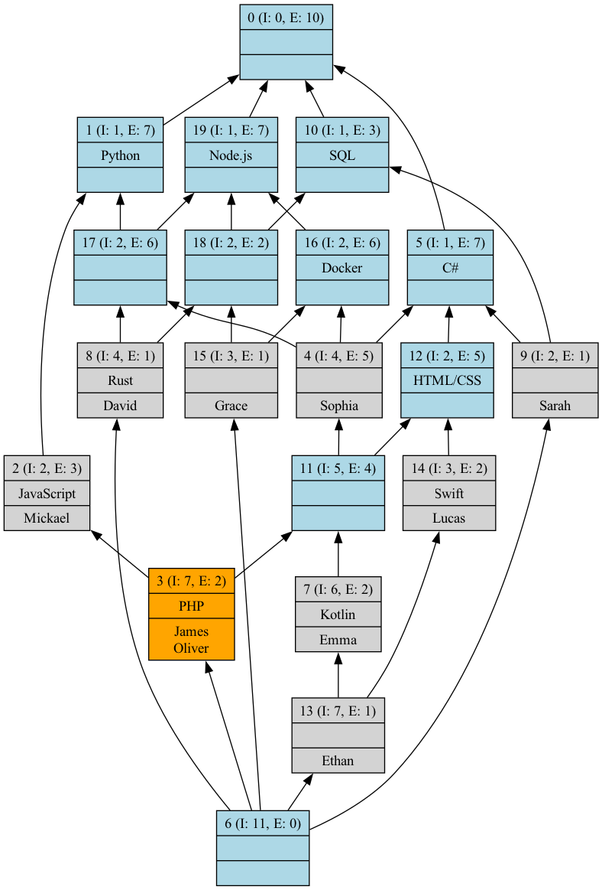
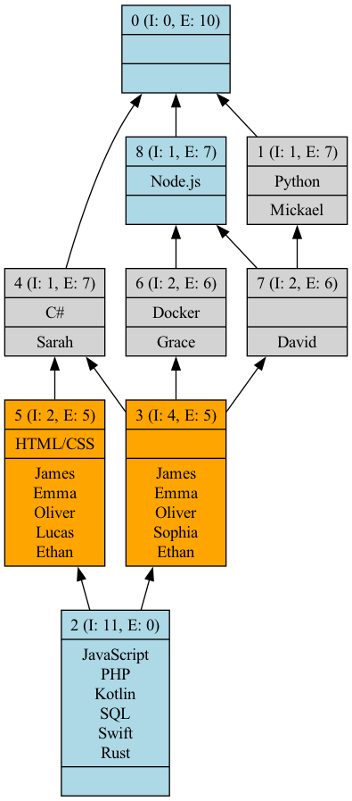
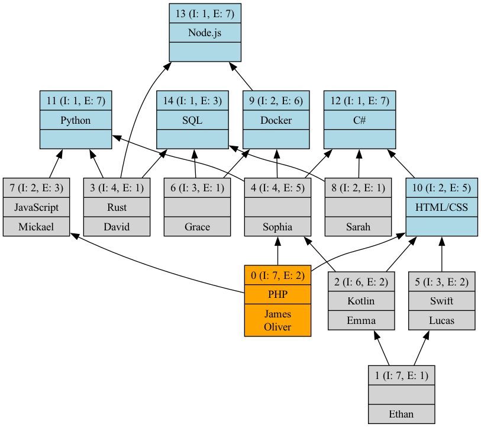
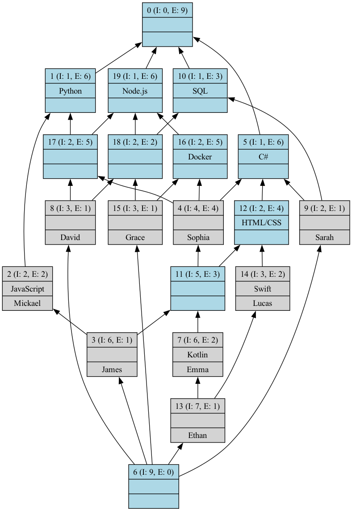
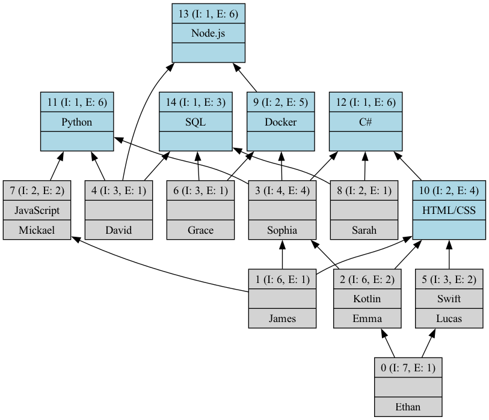

# Formal Concept Analysis (FCA) on the Programming Skills Dataset

## Table of Contents

- [Formal Concept Analysis (FCA) on the Programming Skills Dataset](#formal-concept-analysis-fca-on-the-programming-skills-dataset)
  - [Table of Contents](#table-of-contents)
  - [Introduction](#introduction)
  - [Choice of data](#choice-of-data)
  - [Dataset](#dataset)
  - [Analysis Methods](#analysis-methods)
    - [1. Concept Lattice](#1-concept-lattice)
    - [2. Iceberg Lattice with a Minimum Support of 50%](#2-iceberg-lattice-with-a-minimum-support-of-50)
    - [3. AOC Poset (Attribute-Object Chain Poset)](#3-aoc-poset-attribute-object-chain-poset)
    - [4. DGBI Rule Basis](#4-dgbi-rule-basis)
      - [Explanation of DGBI Rules Results](#explanation-of-dgbi-rules-results)
    - [5. Irreducible Objects and Attributes](#5-irreducible-objects-and-attributes)
    - [6. Clarification and Reduction](#6-clarification-and-reduction)
    - [7. Clarified and Reduced Lattice and AOC Poset](#7-clarified-and-reduced-lattice-and-aoc-poset)

## Introduction

In this report, we explore the application of Formal Concept Analysis (FCA) to a dataset of programming skills. Programming skills are chosen for this example because they represent a complex but structured set of knowledge domains with distinct relationships. These relationships can be between different programming languages, frameworks, tools, or libraries. FCA helps us reveal hidden patterns, commonalities, and hierarchies among these skills, which can be particularly useful for a range of applications, such as curriculum design, skill gap analysis, or recommendation systems in tech education platforms.

## Choice of data

1. **Multi-Dimensional Relationships**: Programming skills do not exist in isolation. Often, mastering one skill may imply familiarity with related tools or technologies. For instance, knowledge of web development might suggest proficiency in HTML, CSS, and JavaScript, while back-end programming could imply skills in databases and server-side languages. FCA allows us to model these relationships, making it easier to explore dependencies and intersections between skills.

2. **Real-World Relevance**: Understanding the structure of programming skills is directly applicable to real-world scenarios like job recruitment, upskilling programs, and educational content creation. For example, identifying core skills and their extensions can inform better decision-making when designing training programs or job qualifications.

3. **Data Complexity**: Programming skills data offers a challenging and interesting dataset for FCA due to its variety, granularity, and hierarchy. This makes it an ideal candidate to showcase the effectiveness of FCA in dealing with real-world, multi-faceted data.

4. **Skill Progression and Implication**: In the tech industry, skills are often acquired progressively. FCA's ability to generate rules and implications between skills provides insights into how mastering one skill might lead to proficiency in another. For example, if a person is proficient in JavaScript, it could imply that they have likely encountered libraries such as React or Vue.js. FCA can help generate these rules automatically from the dataset.

## Dataset

Before diving into the analysis, let's examine the dataset we're working with. The following table represents the programming skills of various individuals. Each row corresponds to a person, and each column represents a specific programming language or technology. A value of 1 indicates proficiency in the skill, while 0 indicates a lack of proficiency.

| Name    | Python | JavaScript | C#  | PHP | Kotlin | SQL | HTML/CSS | Swift | Rust | Docker | Node.js |
| ------- | ------ | ---------- | --- | --- | ------ | --- | -------- | ----- | ---- | ------ | ------- |
| David   | 1      | 0          | 0   | 0   | 0      | 1   | 0        | 0     | 1    | 0      | 1       |
| Mickael | 1      | 1          | 0   | 0   | 0      | 0   | 0        | 0     | 0    | 0      | 0       |
| Sarah   | 0      | 0          | 1   | 0   | 0      | 1   | 0        | 0     | 0    | 0      | 0       |
| James   | 1      | 1          | 1   | 1   | 0      | 0   | 1        | 0     | 0    | 1      | 1       |
| Emma    | 1      | 0          | 1   | 0   | 1      | 0   | 1        | 0     | 0    | 1      | 1       |
| Oliver  | 1      | 1          | 1   | 1   | 0      | 0   | 1        | 0     | 0    | 1      | 1       |
| Sophia  | 1      | 0          | 1   | 0   | 0      | 0   | 0        | 0     | 0    | 1      | 1       |
| Lucas   | 0      | 0          | 1   | 0   | 0      | 0   | 1        | 1     | 0    | 0      | 0       |
| Grace   | 0      | 0          | 0   | 0   | 0      | 1   | 0        | 0     | 0    | 1      | 1       |
| Ethan   | 1      | 0          | 1   | 0   | 1      | 0   | 1        | 1     | 0    | 1      | 1       |

This dataset provides a snapshot of the programming skills distribution among a group of individuals.

The Formal Concept Analysis we'll perform in the following sections will help us uncover more complex patterns and relationships within this dataset.

## Analysis Methods

### 1. Concept Lattice

We begin by constructing a concept lattice using our programming skills dataset. The concept lattice visually represents the relationships between different skills and their groupings.

The following command was used to generate the concept lattice:

```bash
java -jar fca4j-cli-0.4.4.jar LATTICE jeux_de_donnee.csv -i CSV -s SEMICOLON -g ProgramingSkills/Lattice/ProgramingSkillsLattice.dot
dot -Tpdf ProgramingSkills/Lattice/ProgramingSkillsLattice.dot -o ProgramingSkills/Lattice/ProgramingSkillsLattice.pdf
dot -Tpng ProgramingSkills/Lattice/ProgramingSkillsLattice.dot -o ProgramingSkills/Lattice/ProgramingSkills.png
```

This lattice shows how different programming skills are interconnected, helping identify clusters of skills that often appear together. For instance, a lattice could reveal that people who know Python often also have experience with libraries like Pandas or NumPy.



### 2. Iceberg Lattice with a Minimum Support of 50%

In some cases, we may want to focus on the most common skill combinations. The Iceberg lattice allows us to do this by filtering out infrequent combinations and retaining only those that meet a minimum threshold of 50% support:

```bash
java -jar fca4j-cli-0.4.4.jar LATTICE -a ICEBERG jeux_de_donnee.csv -p 50 -i CSV -s SEMICOLON -g ProgramingSkills/Iceberg50/ProgramingSkillsiceberg.dot
dot -Tpdf ProgramingSkills/Iceberg50/ProgramingSkillsiceberg.dot -o ProgramingSkills/Iceberg50/ProgramingSkillsiceberg.pdf
dot -Tpng ProgramingSkills/Iceberg50/ProgramingSkillsiceberg.dot -o ProgramingSkills/Iceberg50/ProgramingSkillsiceberg.png
```

The Iceberg lattice reveals the most popular and relevant combinations of programming skills, providing a simplified view of the dataset that focuses on the dominant patterns.



### 3. AOC Poset (Attribute-Object Chain Poset)

The AOC poset simplifies the representation of the concept lattice by focusing on the essential chains between skills and categories. This is particularly useful when trying to identify core skills and how they relate to more advanced concepts:

```bash
java -jar fca4j-cli-0.4.4.jar AOCPOSET jeux_de_donnee.csv -i CSV -s SEMICOLON -g ProgramingSkills/AOCposet/ProgramingSkillsaocposet.dot
dot -Tpdf ProgramingSkills/AOCposet/ProgramingSkillsaocposet.dot -o ProgramingSkills/AOCposet/ProgramingSkillsaocposet.pdf
dot -Tpng ProgramingSkills/AOCposet/ProgramingSkillsaocposet.dot -o ProgramingSkills/AOCposet/ProgramingSkillsaocposet.png
```

The AOC poset helps us distill the skill progression paths, showing how acquiring a foundational skill leads to learning more specialized technologies.



### 4. DGBI Rule Basis

The DGBI rule basis extracts the logical implications between programming skills. For example, knowing Python might imply familiarity with certain libraries or frameworks:

```bash
java -jar fca4j-cli-0.4.4.jar RULEBASIS jeux_de_donnee.csv -i CSV -s SEMICOLON -folder ProgramingSkills/DGBI/
```

These rules can be useful for generating recommendations for learners or for understanding which skills are likely to be gained together.

#### Explanation of DGBI Rules Results

Let's analyze some of the interesting rules generated by the DGBI algorithm:

1. `<3> JavaScript => Python`
   This rule suggests that knowledge of JavaScript often implies knowledge of Python. This could be because both are popular languages for web development, and developers often learn both to handle both front-end (JavaScript) and back-end (Python) development.

2. `<6> Docker => Node.js`
   This rule indicates that proficiency in Docker is often accompanied by knowledge of Node.js. This makes sense as Docker is frequently used to containerize Node.js applications, making them easier to deploy and scale.

3. `<2> Swift => C#,HTML/CSS`
   This interesting rule suggests that Swift developers often have knowledge of C# and HTML/CSS. This could be because many mobile developers work on cross-platform projects, using Swift for iOS, C# for Windows or Unity game development, and HTML/CSS for web interfaces.

4. `<1> Rust => Python,SQL,Node.js`
   This rule implies that Rust developers often have a diverse skill set including Python, SQL, and Node.js. This could indicate that Rust is often learned by experienced developers who already have a broad programming background.

5. `<5> HTML/CSS => C#`
   This rule suggests that knowledge of HTML/CSS often comes with knowledge of C#. This could be due to the popularity of ASP.NET for web development, where C# is used alongside HTML/CSS.

6. `<2> Kotlin => Python,C#,HTML/CSS,Docker,Node.js`
   This rule indicates that Kotlin developers often have a broad skill set including Python, C#, HTML/CSS, Docker, and Node.js. This could be because Kotlin is often adopted by experienced developers who work on diverse projects.

7. `<0> Python,C#,SQL,Rust,Docker,Node.js => JavaScript,PHP,Kotlin,HTML/CSS,Swift`
   This complex rule suggests that developers with a diverse backend skill set (Python, C#, SQL, Rust, Docker, Node.js) often also have front-end and mobile development skills (JavaScript, PHP, Kotlin, HTML/CSS, Swift). This could indicate full-stack developers or tech leads with broad expertise.

These rules provide valuable insights into the relationships between different programming skills and how they are often acquired or used together. They can be particularly useful for:

- Curriculum design in tech education
- Career path planning for developers
- Skill gap analysis in tech teams
- Recommending additional skills for developers to learn

It's important to note that these rules reflect patterns in the dataset and may not necessarily imply causation. The relationships could be due to various factors such as job market demands, common learning paths, or the complementary nature of certain technologies.

### 5. Irreducible Objects and Attributes

Irreducible elements highlight the core components of the skill set, i.e., the programming skills that cannot be broken down further or implied by any combination of other skills:

Irreducible Objects:

```bash
java -jar fca4j-cli-0.4.4.jar IRREDUCIBLE jeux_de_donnee.csv -lobj -u -i CSV -s SEMICOLON ProgramingSkills/ProgramingSkillsirrobjs.txt
```

Irreducible Attributes:

```bash
java -jar fca4j-cli-0.4.4.jar IRREDUCIBLE jeux_de_donnee.csv -lattr -u -i CSV -s SEMICOLON ProgramingSkills/ProgramingSkillsirrattrs.txt
```

This analysis helps identify the indispensable skills that form the basis of the entire dataset.

### 6. Clarification and Reduction

Clarification is used to remove inconsistencies in the dataset, while reduction simplifies it by removing redundant information. The clarified and reduced dataset offers a more concise representation of the relationships between programming skills:

Clarification:

```bash
java -jar fca4j-cli-0.4.4.jar CLARIFY jeux_de_donnee.csv -xa -xo -i CSV -s SEMICOLON ProgramingSkills/ProgramingSkillsclarified.csv
```

Reduction:

```bash
java -jar fca4j-cli-0.4.4.jar REDUCE ProgramingSkills/ProgramingSkillsclarified.csv -xa -xo -u -i CSV -s SEMICOLON ProgramingSkills/ProgramingSkillsclarifiedreduced.csv
```

After these operations, we obtain a clarified and reduced version of the dataset, which leads to simplified concept lattices and AOC posets.

### 7. Clarified and Reduced Lattice and AOC Poset

Finally, we generate the concept lattice and AOC poset from the clarified and reduced dataset:

Clarified and Reduced Lattice:

```bash
java -jar fca4j-cli-0.4.4.jar LATTICE ProgramingSkills/ProgramingSkillsclarifiedreduced.csv -i CSV -s SEMICOLON -g ProgramingSkills/Reduced/Lattice/ProgramingSkillsclarifiedreduced.dot
dot -Tpdf ProgramingSkills/Reduced/Lattice/ProgramingSkillsclarifiedreduced.dot -o ProgramingSkills/Reduced/Lattice/ProgramingSkillsclarifiedreduced.pdf
dot -Tpng ProgramingSkills/Reduced/Lattice/ProgramingSkillsclarifiedreduced.dot -o ProgramingSkills/Reduced/Lattice/ProgramingSkillsclarifiedreduced.png
```



Clarified and Reduced AOC Poset:

```bash
java -jar fca4j-cli-0.4.4.jar AOCPOSET ProgramingSkills/ProgramingSkillsclarifiedreduced.csv -i CSV -s SEMICOLON -g ProgramingSkills/Reduced/AOCposet/ProgramingSkillsclarifiedreduced.dot
dot -Tpdf ProgramingSkills/Reduced/AOCposet/ProgramingSkillsclarifiedreduced.dot -o ProgramingSkills/Reduced/AOCposet/ProgramingSkillsclarifiedreduced.pdf
dot -Tpng ProgramingSkills/Reduced/AOCposet/ProgramingSkillsclarifiedreduced.dot -o ProgramingSkills/Reduced/AOCposet/ProgramingSkillsclarifiedreduced.png
```


