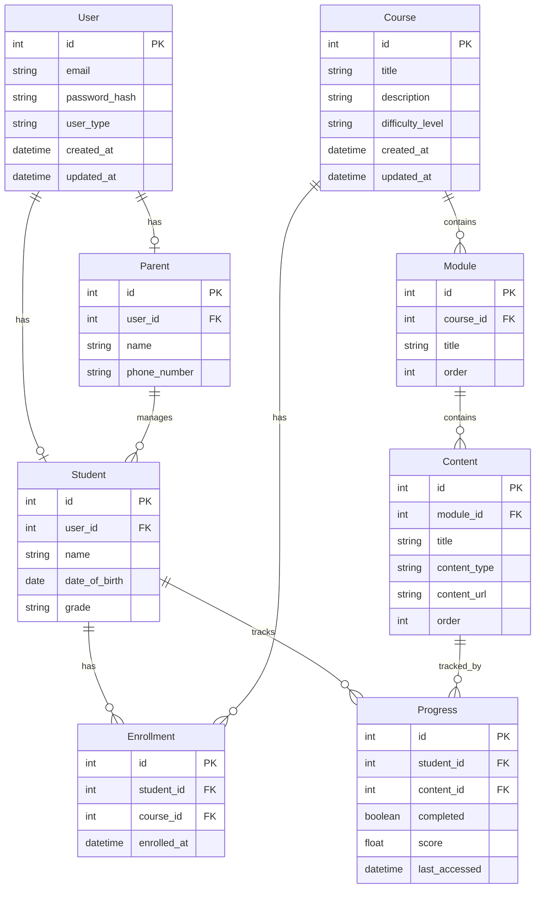

# Summary
In this document, I will explain the steps I followed to complete my work. I used two different LLMs: ChatGPT from OpenAI and Claude from Anthropic. ChatGPT was used for generating precise prompts, while Claude handled code generation and evaluation. My decision was informed by prior research evaluating the performance of LLMs in various fields <a href="https://medium.com/@StephanKeo/claude-3-ai-benchmarks-d45ed4948112">[Article]</a>.

# Part 01: Prompts generation (ChatGPT)

### #User Prompt:
<br>

> i want to create a flutter mobile application using only ai, i have the details and specification of this application as follows:
> L’objectif de ce projet est de créer une application mobile sous Android pour proposer des cours/formation en ligne. L’application schoolmouv constitue un exemple intéressant https://www.schoolmouv.fr/, https://youtube.schoolmouv.fr/ à suivre pour développer cette application.
> Ainsi cette application doit permettre :
> - De présenter les fonctionnalités de cette application.
> - De s’inscrire suivant plusieurs profils.
> - De bénéficier des services fonctionnels de cette application en fonction du profil de
> connexion et en fonction du mode de connexion : online, offline.
> Présentation de l’application. Une fois l’application installée et sans inscription, elle permet à son utilisateur de bénéficier de :
> - Présentation claire et ergonomique de l’application sous différents formats : vidéo, texte, etc.
> - Une démonstration (utilisation) réelle mais temporaire des services de l’application.
> - Une interface de connexion
> - Etc.
> Inscription. L’application permet de s’inscrire selon trois profils :
> - Parent : Dans ce cas, l’application lui propose :
> o De saisir les informations du parent : nom, prénom, choix login, choix mot de
> passe, adresse mail, compte Tweeter, Facebook, etc. Permettre de vérifier l’adresse mail (Par exemple, activation du compte via une lien envoyé à l’adresse mail en renseignée).
> o Dechoisirlenombred’élèvesconcernésparcetteinscriptionetdesaisirleurs profils (nom, prénom, lien de parenté, niveau scolaire, etc.)
> o Dechoisirl’annéeoulesannéesscolairesconcernées.
> o De choisir une formule parmi un ensemble de formules proposées. Par
> exemple :
> § 1 cous par année scolaire.
> § 2 cous par année scolaire.
> § Tous les cours d’une année scolaire. § Etc.
> o Dechoisirunmodedeformationparmideux:
> § Formule progression : Documents électroniques uniquement.
> § Formule accompagnement : accompagnement par un professeur
>   (Accès à un tchat avec un enseignant pour poser ses questions dans
> toutes les matières.).
>
> o Propose un mode de paiement : carte bancaire, prélèvement, etc. et se saisir les informations nécessaires à ce mode de paiement.
> o Proposeetenvoieauparent(entreautres,parmail),desloginsetmotdepasse des élèves concernés. Les parents et les élèves peuvent ainsi se connecter en
> utilisant ces informations. - Elève
> o Même étapes que « parent » avec la seule différence que l’élève sera enregistré sans parent.
> Connexion. Selon le profil de connexion, les fonctionnalités offertes seront différentes :
> - Parent
> o Visualiserlesmomentsdeconnexiondel’élève.
> o Visualiserlescoursetlesexercicesréalisésparl’élève.
> o Visualiserlesduréesd’activitésurl’application.
> o Visualiserdescourbesdeprogression.
> o Visualiserdesrecommandationspourlaprogressiondel’élève.
> § Recommandations pour une progression adaptée à l’élève concerné.
> § Recommandations et conseils généraux.
> o Définirdesmomentsderappelàl’élèvepourrevenirsurl’application. o Etc.
> - Elève
> o Visualiserlesdifférentsarticlesdeformation
> § Cours
> • Vidéo
> • Fiches de cours
> • Présentation § Exercices
> • QCM
> • Questions – Réponses
> § Des cours en temps réel avec possibilité de pose de question.
> • Ces cours sont annoncés préalablement par notification, mails,
> etc. § Tchat
> § Des recommandations pour la progression de l’élève.
> • Recommandations pour une progression adaptée à l’élève
> concerné.
> • Recommandations et conseils généraux.
> o Visualiserl’historiquedesactivitéssurl’application. o Etc.
> L’application permet deux modes de connexion : connexion online et connexion offline. La connexion online permet de se connecter au serveur et de bénéficier de tous les supports (cours, exercices, etc.) disponibles. En mode offline, l’utilisateur ne peut bénéficier que de certaines fonctionnalités en relation avec les données enregistrées localement. Une synchronisation doit être réalisée dès que l’utilisateur passe du mode offline au mode online.
> 
> 
> Il est recommandé de réfléchir à la simplification des modes d’accès aux fonctionnalités de l’application :
> o Utilisation de certains capteurs (exemple, accélération) pour activer ou désactiver certaines fonctionnalités.
> o Utilisationdelavoixpouractiveroudésactivercertainesfonctionnalités.
> o Etc. Partie serveur
> La partie serveur doit permettre de :
> - Stocker toutes les données nécessaires au fonctionnement de l’application, par
> exemple les comptes des utilisateurs, les cours sous leurs différents formats, etc.
> - Implémenter certains algorithmes nécessaires au fonctionnement de l’application
> mobile.
> Le choix de la technologie de réalisation de la partie serveur est libre. Néanmoins, veuillez à appliquer les meilleurs pratiques pour cette partie importante à la majorité des applications mobiles.
> Partie Android
> En plus des services mentionnés ci-dessus, il est vivement recommandé d’utiliser les meilleures pratiques liées au développement Mobile (en Android) telles que Material Design, les fragments, les préférences, les content provider, etc.
> 
> //
> I want you generate me ai prompt to get the all what i need in the most efficient way and explain each step
> 
<br>

### #ChatGPT Response:
```md
To develop your Flutter mobile application efficiently with AI, you'll want to leverage AI tools for various stages such as design,\
code generation, API integration, and testing. Here's a step-by-step breakdown of what you should request from AI tools to assist in\
building this project and an explanation of each step:
```
### 1. App Design: UI/UX Creation

```md
Prompt for AI Design Tools:
"Design a mobile app interface similar to Schoolmouv, focused on online courses with different user profiles (parent, student).
The design should follow Material Design principles, include a clean layout with video, text,
and real-time course features, and provide online/offline modes. I need a homepage,
registration screens for parents and students, login, and dashboards for both profiles."
```

#### Explanation:

- Using AI-powered design tools like Figma or Adobe XD plugins, you can generate designs that adhere to Material Design principles.
- The focus should be on creating a simple, ergonomic, and visually appealing user experience.
- This design will be the foundation for translating into Flutter widgets and components.

### 2. Flutter Code Generation: UI Layout

```md
Prompt for AI Code Generation Tools:
"Generate Flutter code for a mobile app with user profiles (Parent, Student) following Material Design guidelines.
Include the following screens: Home (video, text content), registration (parent and student),
login, and profile-specific dashboards. Ensure compatibility with online/offline mode switching,
and add the ability to store data locally when offline."
```

#### Explanation:

- AI code generation tools like Codex or GitHub Copilot can help generate Flutter code for UI layouts.
- Request code for specific components like registration forms, login screens, and dashboards tailored to the user profile. Make sure to include support for offline data storage (e.g., using SQLite or Hive) and sync features when the app is back online.

### 3. Back-End Development: API and Database Integration

```md
Prompt for AI Back-End Development:
"Generate a back-end for a Flutter app offering online courses.
Include a database schema for storing user profiles (Parent, Student), course materials (videos, documents),
and progress tracking. Design APIs for user registration, login, course retrieval,
progress tracking, and data synchronization for offline mode. Recommend a technology stack for scalable performance."
```

#### Explanation:

- The server side must handle user authentication, course delivery, progress tracking, and syncing data between online and offline modes.
- AI can help generate RESTful APIs or GraphQL endpoints, as well as suggest databases (SQL or NoSQL) to efficiently manage user data and course content.
- Technologies such as Node.js with Express, Django, or Firebase can be integrated based on your preferences.

### 4. Online/Offline Synchronization

```md
Prompt for AI Synchronization Logic:
"Create Flutter code that enables data synchronization between offline and online modes. Use local storage for offline data and trigger synchronization to the server when the user goes back online. Implement best practices for data syncing and conflict resolution."
```

#### Explanation:

- Offline data storage should be managed using local databases like SQLite or Hive, and sync logic should be set to trigger when the app detects an internet connection.
- AI can help implement sync algorithms to avoid conflicts and ensure that the user’s progress is updated correctly.

### 5. AI-Powered Features: Voice Control and Sensor Usage

```md
Prompt for AI-Enhanced Features:
"Generate Flutter code to implement voice controls for navigating the app (activating specific features) and use accelerometer sensors to control certain app functionalities like switching between online and offline mode."
```

#### Explanation:

- AI tools can help integrate voice command functionalities using libraries like flutter_speech and sensor data with Flutter’s sensor plugin.
- This step enhances user experience, especially for accessibility and ease of navigation.

### 6. Payment Integration

```md
Prompt for Payment API Integration:
"Integrate a secure payment system into the Flutter app to support credit cards and other methods.
Allow parents to purchase course subscriptions, and generate secure payment flows
following best practices (e.g., PCI compliance)."
```

#### Explanation:

- You will likely need to integrate third-party APIs such as Stripe or PayPal for secure transactions.
- AI can generate the payment flow logic and ensure that sensitive data is handled securely.

### 7. User Authentication

```md
Prompt for Authentication:
"Generate Flutter code for user authentication using email verification, social login (Twitter, Facebook),
and parent-student account linkages. Ensure secure storage of credentials
and handle account verification through email activation."
```

#### Explanation:

- This step involves handling secure login and signup processes.
- AI can provide code for Firebase Authentication or custom email verification using API calls, ensuring a secure experience for the app users.

### 8. Testing and Debugging

```md
Prompt for AI Testing Assistance:
"Generate test cases for a Flutter app with online/offline modes, covering user registration, login, course retrieval, progress tracking, and payment flows. Include both unit tests and integration tests to ensure the app works as expected."
```

#### Explanation:

- AI can generate test cases and scripts to ensure that all features (online/offline modes, data sync, payment, etc.) work properly and there are no performance issues.
- Tools like SonarQube or other testing tools can help automate the creation of tests for your Flutter app.

### 9. Testing and Debugging

```md
Prompt for AI Testing Assistance:
"Generate test cases for a Flutter app with online/offline modes, covering user registration, login, course retrieval, progress tracking, and payment flows. Include both unit tests and integration tests to ensure the app works as expected."
```

#### Explanation:

- AI can generate test cases and scripts to ensure that all features (online/offline modes, data sync, payment, etc.) work properly and there are no performance issues.
- Tools like SonarQube or other testing tools can help automate the creation of tests for your Flutter app.

# Part 02: Code Generation (Claude.ai)

### #User Prompt:

> Design a mobile app interface similar to Schoolmouv, focused on online courses with different user profiles (parent, student). The design should follow Material Design principles, include a clean layout with video, text, and real-time course features, and provide online/offline modes. I need a homepage, registration screens for parents and students, login, and dashboards for both profiles.

### #Claude.ai response:

```md
Certainly! I'd be happy to design a mobile app interface similar to Schoolmouv,
focusing on online courses with different user profiles. I'll create a React Native component for the homepage,
which will serve as a starting point for the app's design.
This component will incorporate Material Design principles and showcase some of the key features you've mentioned.
```

````dart
import 'package:flutter/material.dart';

void main() {
  runApp(MyApp());
}

class MyApp extends StatelessWidget {
  @override
  Widget build(BuildContext context) {
    return MaterialApp(
      title: 'EduConnect',
      theme: ThemeData(
        primarySwatch: Colors.deepPurple,
        visualDensity: VisualDensity.adaptivePlatformDensity,
      ),
      home: HomePage(),
    );
  }
}

class HomePage extends StatelessWidget {
  @override
  Widget build(BuildContext context) {
    return Scaffold(
      body: SingleChildScrollView(
        child: Column(
          crossAxisAlignment: CrossAxisAlignment.stretch,
          children: <Widget>[
            Container(
              padding: EdgeInsets.all(20),
              color: Colors.deepPurple,
              child: Column(
                children: <Widget>[
                  SizedBox(height: 40),
                  Text(
                    'EduConnect',
                    style: TextStyle(
                      fontSize: 28,
                      fontWeight: FontWeight.bold,
                      color: Colors.white,
                    ),
                  ),
                  SizedBox(height: 8),
                  Text(
                    'Learn Anytime, Anywhere',
                    style: TextStyle(
                      fontSize: 16,
                      color: Colors.white,
                    ),
                  ),
                ],
              ),
            ),
            Padding(
              padding: EdgeInsets.all(20),
              child: Row(
                mainAxisAlignment: MainAxisAlignment.spaceAround,
                children: <Widget>[
                  Expanded(
                    child: OutlinedButton(
                      child: Text('Student Login'),
                      onPressed: () {},
                      style: OutlinedButton.styleFrom(
                        foregroundColor: Colors.deepPurple,
                      ),
                    ),
                  ),
                  SizedBox(width: 20),
                  Expanded(
                    child: OutlinedButton(
                      child: Text('Parent Login'),
                      onPressed: () {},
                      style: OutlinedButton.styleFrom(
                        foregroundColor: Colors.deepPurple,
                      ),
                    ),
                  ),
                ],
              ),
            ),
            Padding(
              padding: EdgeInsets.symmetric(horizontal: 20),
              child: GridView.count(
                crossAxisCount: 2,
                shrinkWrap: true,
                physics: NeverScrollableScrollPhysics(),
                childAspectRatio: 1.5,
                children: <Widget>[
                  _buildFeatureCard(Icons.video_library, 'Video Lessons'),
                  _buildFeatureCard(Icons.book, 'Interactive Texts'),
                  _buildFeatureCard(Icons.people, 'Live Classes'),
                  _buildFeatureCard(Icons.access_time, '24/7 Access'),
                ],
              ),
            ),
            Padding(
              padding: EdgeInsets.all(20),
              child: ElevatedButton(
                child: Text('Get Started'),
                onPressed: () {},
                style: ElevatedButton.styleFrom(
                  backgroundColor: Colors.deepPurple,
                  foregroundColor: Colors.white,
                  padding: EdgeInsets.symmetric(vertical: 15),
                ),
              ),
            ),
          ],
        ),
      ),
    );
  }

  Widget _buildFeatureCard(IconData icon, String text) {
    return Card(
      child: Column(
        mainAxisAlignment: MainAxisAlignment.center,
        children: <Widget>[
          Icon(icon, size: 40, color: Colors.deepPurple),
          SizedBox(height: 8),
          Text(
            text,
            textAlign: TextAlign.center,
            style: TextStyle(color: Colors.black87),
          ),
        ],
      ),
    );
  }
}
````

```md
This Flutter implementation creates a homepage for the EduConnect app, similar to Schoolmouv.
Here's a breakdown of the design and its adherence to Material Design principles:

1. Colors: The primary color used is Colors.deepPurple, which is equivalent to the #6200ee we used before. It's used for the header background and the main call-to-action button.

2. Typography: The app uses a clear hierarchy with different font sizes for the title, subtitle, and other text elements, following Material Design guidelines.

3. Layout: The design follows a card-based layout, which is a key principle of Material Design. The features are displayed in Card widgets.

4. Icons: The design uses Material Icons, which are built into Flutter and follow Material Design guidelines.

5. Buttons: The login buttons use OutlinedButton, while the main call-to-action uses ElevatedButton, following Material Design button guidelines.

6. Spacing: The layout uses consistent padding and SizedBox widgets for spacing between elements, adhering to Material Design's 8dp grid system.

This homepage showcases the following features:

1. Clean layout with a prominent title and subtitle

2. Login options for both students and parents
3. Feature highlights using icons and text
4. A clear call-to-action button to get started

To complete the app design, you would need to create additional screens:

1. Registration screens for parents and students
2. Login screen
3. Student dashboard
4. Parent dashboard
```

### #User Prompt:

> Generate Flutter code for a mobile app with user profiles (Parent, Student) following Material Design guidelines. Include the following screens: Home (video, text content), registration (parent and student), login, and profile-specific dashboards. Ensure compatibility with online/offline mode switching, and add the ability to store data locally when offline.

### #Claude.ai response:

```md
Certainly! I'll create a Flutter project structure with the screens you've requested, following Material Design guidelines.
I'll also include basic functionality for online/offline mode and local data storage.
Let's break this down into multiple parts.
```

```md
First, let's start with the project structure and main.dart file:
```

````dart
// File: lib/main.dart

import 'package:flutter/material.dart';
import 'package:provider/provider.dart';
import 'screens/home_screen.dart';
import 'screens/login_screen.dart';
import 'screens/registration_screen.dart';
import 'screens/student_dashboard_screen.dart';
import 'screens/parent_dashboard_screen.dart';
import 'services/auth_service.dart';
import 'services/connectivity_service.dart';

void main() {
  runApp(
    MultiProvider(
      providers: [
        ChangeNotifierProvider(create: (_) => AuthService()),
        ChangeNotifierProvider(create: (_) => ConnectivityService()),
      ],
      child: MyApp(),
    ),
  );
}

class MyApp extends StatelessWidget {
  @override
  Widget build(BuildContext context) {
    return MaterialApp(
      title: 'EduConnect',
      theme: ThemeData(
        primarySwatch: Colors.deepPurple,
        accentColor: Colors.deepOrangeAccent,
        visualDensity: VisualDensity.adaptivePlatformDensity,
      ),
      initialRoute: '/',
      routes: {
        '/': (context) => HomeScreen(),
        '/login': (context) => LoginScreen(),
        '/register': (context) => RegistrationScreen(),
        '/student_dashboard': (context) => StudentDashboardScreen(),
        '/parent_dashboard': (context) => ParentDashboardScreen(),
      },
    );
  }
}

// File: lib/services/auth_service.dart

import 'package:flutter/foundation.dart';

class AuthService with ChangeNotifier {
  bool _isLoggedIn = false;
  String _userType = '';

  bool get isLoggedIn => _isLoggedIn;
  String get userType => _userType;

  void login(String userType) {
    _isLoggedIn = true;
    _userType = userType;
    notifyListeners();
  }

  void logout() {
    _isLoggedIn = false;
    _userType = '';
    notifyListeners();
  }
}

// File: lib/services/connectivity_service.dart

import 'package:flutter/foundation.dart';

class ConnectivityService with ChangeNotifier {
  bool _isOnline = true;

  bool get isOnline => _isOnline;

  void setOnlineStatus(bool status) {
    _isOnline = status;
    notifyListeners();
  }
}

// Project structure:
// lib/
//   ├── main.dart
//   ├── screens/
//   │   ├── home_screen.dart
//   │   ├── login_screen.dart
//   │   ├── registration_screen.dart
//   │   ├── student_dashboard_screen.dart
//   │   └── parent_dashboard_screen.dart
//   ├── services/
//   │   ├── auth_service.dart
//   │   └── connectivity_service.dart
//   └── models/
//       └── content_model.dart
````

```md
Now, let's create the HomeScreen:
```

````dart
// File: lib/screens/home_screen.dart

import 'package:flutter/material.dart';
import 'package:provider/provider.dart';
import '../services/auth_service.dart';
import '../services/connectivity_service.dart';

class HomeScreen extends StatelessWidget {
  @override
  Widget build(BuildContext context) {
    final authService = Provider.of<AuthService>(context);
    final connectivityService = Provider.of<ConnectivityService>(context);

    return Scaffold(
      appBar: AppBar(
        title: Text('EduConnect'),
        actions: [
          Switch(
            value: connectivityService.isOnline,
            onChanged: (value) {
              connectivityService.setOnlineStatus(value);
            },
          ),
        ],
      ),
      body: SingleChildScrollView(
        child: Padding(
          padding: EdgeInsets.all(16.0),
          child: Column(
            crossAxisAlignment: CrossAxisAlignment.start,
            children: [
              Text(
                'Welcome to EduConnect',
                style: Theme.of(context).textTheme.headline4,
              ),
              SizedBox(height: 16),
              Text(
                'Featured Video',
                style: Theme.of(context).textTheme.headline6,
              ),
              SizedBox(height: 8),
              Container(
                height: 200,
                color: Colors.grey[300],
                child: Center(child: Text('Video Player Placeholder')),
              ),
              SizedBox(height: 16),
              Text(
                'Latest Content',
                style: Theme.of(context).textTheme.headline6,
              ),
              SizedBox(height: 8),
              ListView.builder(
                shrinkWrap: true,
                physics: NeverScrollableScrollPhysics(),
                itemCount: 5,
                itemBuilder: (context, index) {
                  return ListTile(
                    title: Text('Content Item ${index + 1}'),
                    subtitle: Text('Description of content item ${index + 1}'),
                    leading: Icon(Icons.article),
                  );
                },
              ),
            ],
          ),
        ),
      ),
      floatingActionButton: authService.isLoggedIn
          ? FloatingActionButton(
              onPressed: () {
                Navigator.pushNamed(
                  context,
                  authService.userType == 'student'
                      ? '/student_dashboard'
                      : '/parent_dashboard',
                );
              },
              child: Icon(Icons.dashboard),
            )
          : FloatingActionButton.extended(
              onPressed: () {
                Navigator.pushNamed(context, '/login');
              },
              label: Text('Login'),
              icon: Icon(Icons.login),
            ),
    );
  }
}
````

```md
Now, let's create the LoginScreen and RegistrationScreen:
```

````dart
// File: lib/screens/login_screen.dart

import 'package:flutter/material.dart';
import 'package:provider/provider.dart';
import '../services/auth_service.dart';

class LoginScreen extends StatelessWidget {
  @override
  Widget build(BuildContext context) {
    final authService = Provider.of<AuthService>(context);

    return Scaffold(
      appBar: AppBar(title: Text('Login')),
      body: Padding(
        padding: EdgeInsets.all(16.0),
        child: Column(
          mainAxisAlignment: MainAxisAlignment.center,
          children: [
            TextField(
              decoration: InputDecoration(labelText: 'Email'),
            ),
            SizedBox(height: 16),
            TextField(
              decoration: InputDecoration(labelText: 'Password'),
              obscureText: true,
            ),
            SizedBox(height: 24),
            ElevatedButton(
              child: Text('Login'),
              onPressed: () {
                // Implement login logic here
                authService.login('student'); // or 'parent'
                Navigator.pushReplacementNamed(context, '/student_dashboard');
              },
            ),
            TextButton(
              child: Text('Don\'t have an account? Register'),
              onPressed: () {
                Navigator.pushNamed(context, '/register');
              },
            ),
          ],
        ),
      ),
    );
  }
}

// File: lib/screens/registration_screen.dart

import 'package:flutter/material.dart';

class RegistrationScreen extends StatefulWidget {
  @override
  _RegistrationScreenState createState() => _RegistrationScreenState();
}

class _RegistrationScreenState extends State<RegistrationScreen> {
  String _userType = 'student';

  @override
  Widget build(BuildContext context) {
    return Scaffold(
      appBar: AppBar(title: Text('Register')),
      body: Padding(
        padding: EdgeInsets.all(16.0),
        child: Column(
          mainAxisAlignment: MainAxisAlignment.center,
          children: [
            DropdownButton<String>(
              value: _userType,
              items: [
                DropdownMenuItem(child: Text('Student'), value: 'student'),
                DropdownMenuItem(child: Text('Parent'), value: 'parent'),
              ],
              onChanged: (value) {
                setState(() {
                  _userType = value!;
                });
              },
            ),
            SizedBox(height: 16),
            TextField(
              decoration: InputDecoration(labelText: 'Name'),
            ),
            SizedBox(height: 16),
            TextField(
              decoration: InputDecoration(labelText: 'Email'),
            ),
            SizedBox(height: 16),
            TextField(
              decoration: InputDecoration(labelText: 'Password'),
              obscureText: true,
            ),
            SizedBox(height: 24),
            ElevatedButton(
              child: Text('Register'),
              onPressed: () {
                // Implement registration logic here
                Navigator.pop(context);
              },
            ),
          ],
        ),
      ),
    );
  }
}
````

```md
Finally, let's create the StudentDashboardScreen and ParentDashboardScreen:
```

````dart
// File: lib/screens/student_dashboard_screen.dart

import 'package:flutter/material.dart';
import 'package:provider/provider.dart';
import '../services/connectivity_service.dart';

class StudentDashboardScreen extends StatelessWidget {
  @override
  Widget build(BuildContext context) {
    final connectivityService = Provider.of<ConnectivityService>(context);

    return Scaffold(
      appBar: AppBar(
        title: Text('Student Dashboard'),
        actions: [
          Switch(
            value: connectivityService.isOnline,
            onChanged: (value) {
              connectivityService.setOnlineStatus(value);
            },
          ),
        ],
      ),
      body: ListView(
        children: [
          ListTile(
            title: Text('My Courses'),
            leading: Icon(Icons.school),
            onTap: () {
              // Navigate to courses screen
            },
          ),
          ListTile(
            title: Text('Assignments'),
            leading: Icon(Icons.assignment),
            onTap: () {
              // Navigate to assignments screen
            },
          ),
          ListTile(
            title: Text('Progress'),
            leading: Icon(Icons.trending_up),
            onTap: () {
              // Navigate to progress screen
            },
          ),
          ListTile(
            title: Text('Schedule'),
            leading: Icon(Icons.calendar_today),
            onTap: () {
              // Navigate to schedule screen
            },
          ),
        ],
      ),
    );
  }
}

// File: lib/screens/parent_dashboard_screen.dart

import 'package:flutter/material.dart';
import 'package:provider/provider.dart';
import '../services/connectivity_service.dart';

class ParentDashboardScreen extends StatelessWidget {
  @override
  Widget build(BuildContext context) {
    final connectivityService = Provider.of<ConnectivityService>(context);

    return Scaffold(
      appBar: AppBar(
        title: Text('Parent Dashboard'),
        actions: [
          Switch(
            value: connectivityService.isOnline,
            onChanged: (value) {
              connectivityService.setOnlineStatus(value);
            },
          ),
        ],
      ),
      body: ListView(
        children: [
          ListTile(
            title: Text('Child\'s Progress'),
            leading: Icon(Icons.trending_up),
            onTap: () {
              // Navigate to progress screen
            },
          ),
          ListTile(
            title: Text('Upcoming Assignments'),
            leading: Icon(Icons.assignment),
            onTap: () {
              // Navigate to assignments screen
            },
          ),
          ListTile(
            title: Text('Schedule'),
            leading: Icon(Icons.calendar_today),
            onTap: () {
              // Navigate to schedule screen
            },
          ),
          ListTile(
            title: Text('Teacher Communication'),
            leading: Icon(Icons.message),
            onTap: () {
              // Navigate to communication screen
            },
          ),
        ],
      ),
    );
  }
}
````

```md

This setup provides a basic structure for the EduConnect app with the following features:

1. Material Design theme
2. Home screen with video and text content placeholders
3. Login and registration screens for both parent and student profiles
4. Profile-specific dashboards (student and parent)
5. Online/offline mode toggle (using a switch in the app bar)
6. Basic authentication service
7. Basic connectivity service for online/offline status

To complete the app, you would need to:

1. Implement actual video playback functionality
2. Create a data model for courses, assignments, and other content
3. Implement local storage for offline mode (consider using SQLite or Hive)
4. Add more detailed screens for courses, assignments, progress, etc.
5. Implement actual authentication with a backend service
```

### #User Prompt:

> Generate a back-end for a Flutter app offering online courses. Include a database schema for storing user profiles (Parent, Student), course materials (videos, documents), and progress tracking. Design APIs for user registration, login, course retrieval, progress tracking, and data synchronization for offline mode. Recommend a technology stack for scalable performance.

### #Claude.ai response:

```md
Certainly! I'll design a back-end system for your Flutter app that offers online courses. I'll include a database schema, API designs, and recommend a technology stack for scalable performance.
```

```md
Let's start with the database schema:
```



```md
Now, let's design the APIs for the various functionalities:
```

```md
# EduConnect API Design

## Authentication

### User Registration
- **POST** `/api/auth/register`
  - Request Body: `{ email, password, user_type, name, date_of_birth?, grade?, phone_number? }`
  - Response: `{ user_id, token }`

### User Login
- **POST** `/api/auth/login`
  - Request Body: `{ email, password }`
  - Response: `{ user_id, token, user_type }`

## User Profile

### Get User Profile
- **GET** `/api/users/profile`
  - Headers: `Authorization: Bearer <token>`
  - Response: `{ user_id, email, user_type, name, ... }`

### Update User Profile
- **PUT** `/api/users/profile`
  - Headers: `Authorization: Bearer <token>`
  - Request Body: `{ name, date_of_birth?, grade?, phone_number? }`
  - Response: `{ success: true }`

## Courses

### Get All Courses
- **GET** `/api/courses`
  - Query Params: `page, limit, difficulty_level?`
  - Response: `{ courses: [{ id, title, description, difficulty_level }], total_count }`

### Get Course Details
- **GET** `/api/courses/{course_id}`
  - Response: `{ id, title, description, difficulty_level, modules: [{ id, title, order }] }`

### Get Module Contents
- **GET** `/api/modules/{module_id}/contents`
  - Response: `{ module_id, title, contents: [{ id, title, content_type, content_url, order }] }`

## Enrollment

### Enroll in a Course
- **POST** `/api/enrollments`
  - Headers: `Authorization: Bearer <token>`
  - Request Body: `{ course_id }`
  - Response: `{ enrollment_id }`

### Get User's Enrolled Courses
- **GET** `/api/users/enrollments`
  - Headers: `Authorization: Bearer <token>`
  - Response: `{ enrollments: [{ course_id, title, enrolled_at }] }`

## Progress Tracking

### Update Progress
- **POST** `/api/progress`
  - Headers: `Authorization: Bearer <token>`
  - Request Body: `{ content_id, completed, score? }`
  - Response: `{ success: true }`

### Get User's Progress for a Course
- **GET** `/api/courses/{course_id}/progress`
  - Headers: `Authorization: Bearer <token>`
  - Response: `{ course_id, progress: [{ content_id, completed, score, last_accessed }] }`

## Data Synchronization

### Sync Offline Progress
- **POST** `/api/sync/progress`
  - Headers: `Authorization: Bearer <token>`
  - Request Body: `[{ content_id, completed, score, last_accessed }]`
  - Response: `{ success: true, synced_count: number }`

### Get Latest Content Updates
- **GET** `/api/sync/content`
  - Headers: `Authorization: Bearer <token>`
  - Query Params: `last_sync_timestamp`
  - Response: `{ updated_content: [{ id, module_id, title, content_type, content_url, order, updated_at }] }`
```

```md
Now, let's recommend a technology stack for scalable performance:
```

```md
## Backend Language and Framework

**Node.js with Express.js**  
*Reasons:* Fast, non-blocking I/O, great for handling concurrent requests, large ecosystem of packages.

## Database

**PostgreSQL**  
*Reasons:* Robust, supports complex queries, handles relationships well, good for structured data.

## ORM (Object-Relational Mapping)

**Sequelize**  
*Reasons:* Works well with PostgreSQL, provides easy data modeling and migration.

## Authentication

**JSON Web Tokens (JWT)**  
*Reasons:* Stateless, scalable, secure for API authentication.

## API Documentation

**Swagger/OpenAPI**  
*Reasons:* Industry standard, helps in testing and client generation.

## Caching

**Redis**  
*Reasons:* In-memory data store, great for caching and improving read performance.

## File Storage

**Amazon S3 or Google Cloud Storage**  
*Reasons:* Scalable, reliable for storing and serving course content (videos, documents).

## Server Hosting

**Docker containers on Kubernetes**  
*Reasons:* Easy scaling, deployment, and management of microservices.

## CI/CD

**GitHub Actions or GitLab CI**  
*Reasons:* Automate testing and deployment processes.

## Monitoring and Logging

**ELK Stack (Elasticsearch, Logstash, Kibana) or Prometheus with Grafana**  
*Reasons:* Comprehensive logging and monitoring solution.

---

### For implementing offline mode and synchronization:

- Use a service worker in the Flutter app to cache API responses and handle offline requests.
- Implement a queue system (like Bull with Redis) on the backend to handle bulk synchronization requests.
- Use WebSockets (Socket.io with Node.js) for real-time updates when the app comes back online.

---

### To implement this backend:

1. Set up a Node.js project with Express.js.
2. Use Sequelize to define models based on the database schema.
3. Implement the API endpoints as defined in the API design.
4. Set up JWT authentication middleware.
5. Implement data validation using a library like Joi.
6. Set up Redis for caching frequently accessed data (like course listings).
7. Use an ODM like Mongoose for MongoDB to store unstructured data if needed.
8. Implement rate limiting and other security best practices.
9. Set up Swagger for API documentation.
10. Containerize the application using Docker.
11. Set up CI/CD pipelines for automated testing and deployment.

Would you like me to elaborate on any specific part of this backend design or implementation?

```
